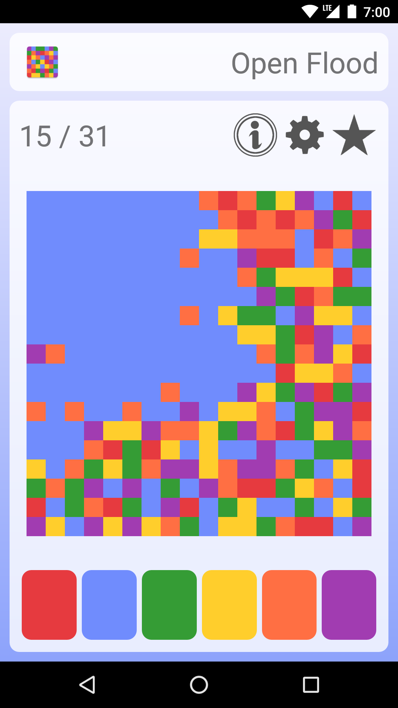

<p align="center">
  
</p>

<h1 align="center">Open Flood</h1>

<p align="center">
  <a href="https://play.google.com/store/apps/details?id=com.gunshippenguin.openflood">
      
  </a>
  <a href="https://f-droid.org/repository/browse/?fdid=com.gunshippenguin.openflood">
      
  </a>
</p>

A flood fill puzzle game for Android.

## Gameplay

You start in the upper left hand corner of the board. Tap the colored buttons
along the bottom of the board to flood all adjacent filled cells with that
color. The aim of the game is to try to fill the entire board with a single
color in less than the maximum number of allowed moves.

You can customize the number of colors and the board size by tapping the gear
icon.

You can generate a board from a seed by holding down the new game (star) icon.

## Building / Installing

Build and install using Android Studio or from the command line by executing the
following commands.

To build and install on \*nix:

```
./gradlew installDebug
```

To build on Windows:

```
gradlew.bat installDebug
```

To build without installing, use the `assembleDebug` task instead. This will
output a debug apk in `app/build/outputs/apk/debug`

## License

[MIT](https://github.com/GunshipPenguin/open_flood/blob/master/LICENSE)
© Rhys Rustad-Elliott
